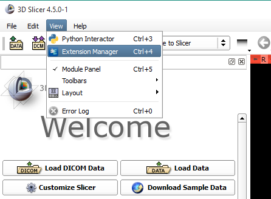
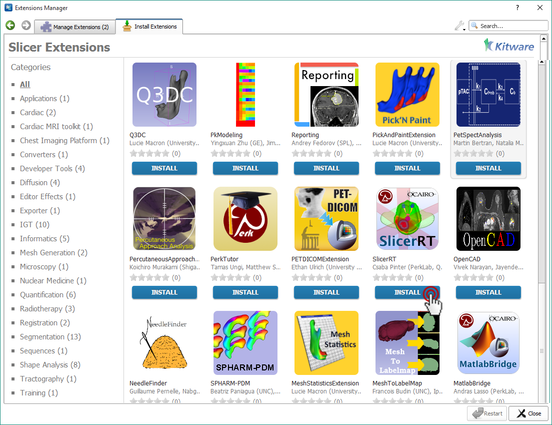

#Download and install 3D Slicer

*   Latest stable Slicer release is <b>recommended</b> to use for SlicerRT. These packages for Windows, Mac, and Linux can be downloaded from the [3D Slicer download page](http://download.slicer.org/).  
*   Nightly Slicer builds can be used to access cutting edge Slicer features (the installed SlicerRT is still the officially released version). These packages can be downloaded from the [nightly dashboard](http://slicer.cdash.org/index.php?project=Slicer4) (click on the yellow box icon next to the build corresponding to your platform and use the link provided there). Note: Nightly builds may fail from time to time. If the current nightly is missing, it is possible to see builds from previous days.

#Install SlicerRT

*   Start 3D Slicer
  
*   Open Extension Manager
  

  
*   Install SlicerRT
  

#System requirements
To run 3D Slicer you need the following configuration (SlicerRT extensions do not have any additional requirement):
*   Computer with a 64-bit operating system  [required]. Note that Windows executables are created for 32-bit systems, but they are not suitable for any work that involves loading and processing of more than one volumetric image.
*   Minimum 6GB RAM [recommended for optimal performance]
*   Dedicated nVidia GPU with 1GB RAM [recommended for 3D graphics display performance]. Note that integrated graphics cards are very slow compared to dedicated ones.
*   Quad-core intel processor [recommended for optimal processing speed]
