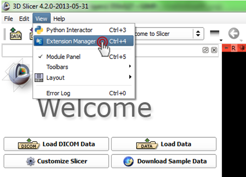

#Download and install 3D Slicer

*   The Slicer nightly packages <b>recommended for SlicerRT</b> can be downloaded from here: 
Windows 64bit: [2013-08-26](http://slicer.kitware.com/midas3/api/rest?method=midas.bitstream.download&name=Slicer-4.2.2-2013-08-26-win-amd64.exe&checksum=341b17ab9def2f2672b7ec20e49ca3b2) 
Linux 64bit: [2013-08-26](http://slicer.kitware.com/midas3/api/rest?method=midas.bitstream.download&name=Slicer-4.2.2-2013-08-26-linux-amd64.tar.gz&checksum=426abf69bf9c166d5892bb04c121f65e) 
Mac: [2013-08-28](http://slicer.kitware.com/midas3/api/rest?method=midas.bitstream.download&name=Slicer-4.2.2-2013-08-28-macosx-amd64.dmg&checksum=dece0f4c4f5e54a89a6ed8b17b01c998)

*   Stable release 
The stable release lacks several new features of SlicerRT, and is not supported any more (new features cannot be backported). These packages for Windows, Mac, and Linux can be downloaded from the [3D Slicer download page](http://download.slicer.org/). 
The missing features are:
    *   Patient Hierarchy
    *   Vff reader
    *   Many bugfixes 

#Install SlicerRT

*   Start 3D Slicer
  
*   Open Extension Manager
  

  
*   Install SlicerRT
  

