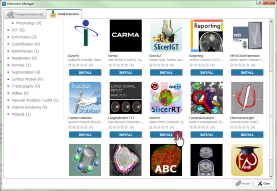

#Download and install 3D Slicer

Packages for Windows, Mac, and Linux can be downloaded from the [3D Slicer download page](http://http://download.slicer.org/). We recommend using the stable release.

#Install SlicerRT

*   Start 3D Slicer
*   Open Extension Manager
 
*   Install SlicerRT
 
